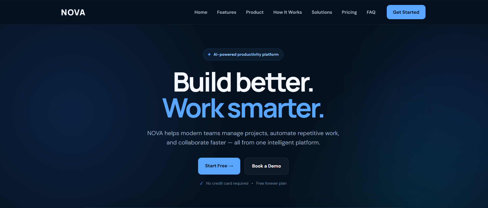
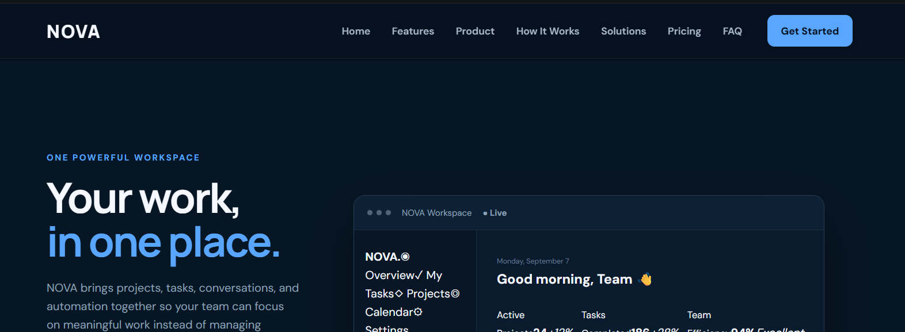
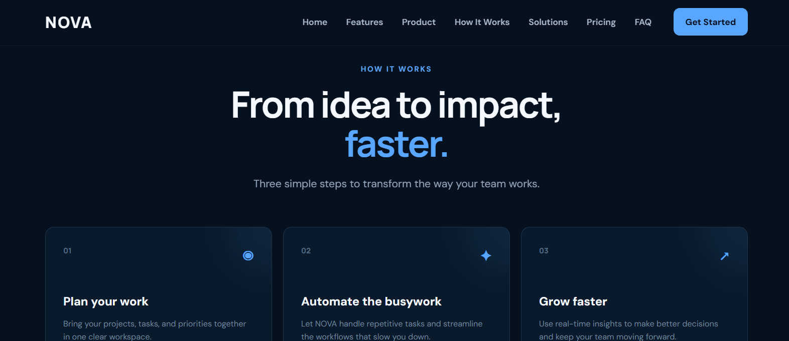
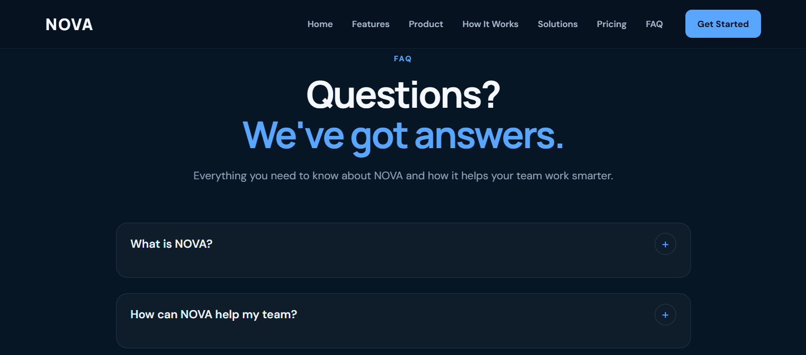
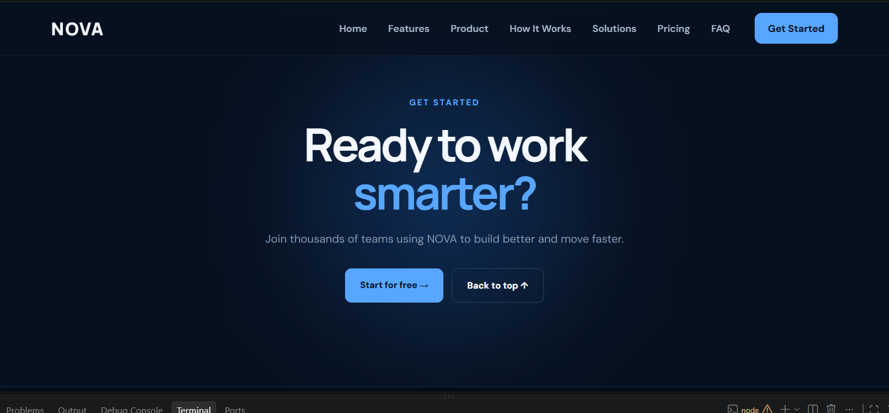
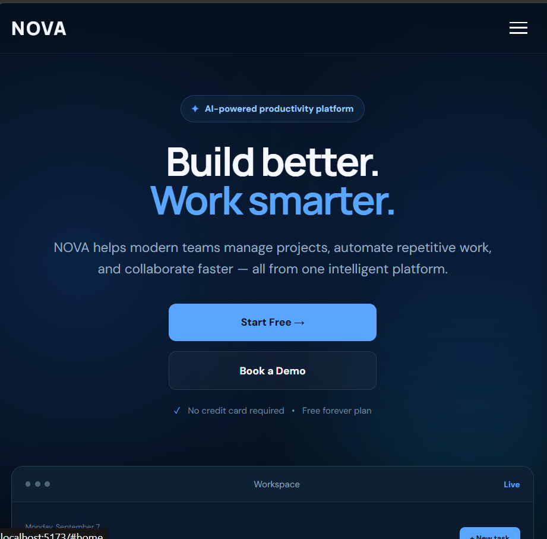

# NOVA — AI Productivity Platform

> **Build Better. Work Smarter.**

NOVA is a modern AI-powered productivity platform designed to help teams manage projects, automate repetitive tasks, and collaborate efficiently from one powerful workspace.

This project was developed as a **Front-End Development Intern Assignment** with a focus on modern UI/UX, responsive design, reusable React components, interactive functionality, accessibility, and clean code organization.

---

## Live Demo

🔗 **Vercel:**
https://nova-landing-page-ruby.vercel.app/

---

## Source Code

🔗 **GitHub Repository:**
https://github.com/kolianushka285-alt/NOVA-Landing-Page

---

## Project Overview

NOVA is a fictional AI productivity platform created to demonstrate how a modern company landing page can be designed and developed using React and Vite.

The website focuses on:

* Modern SaaS-style UI
* Clean visual hierarchy
* Responsive layouts
* Interactive components
* Reusable React components
* Smooth navigation
* Mobile-friendly experience
* Basic accessibility practices

---

## Technologies Used

* **React**
* **Vite**
* **JavaScript (ES6+)**
* **HTML5**
* **CSS3**
* **Git**
* **GitHub**
* **Vercel**

---

## Required Sections

The website includes all required sections from the internship assignment:

### 1. Navigation Bar

Responsive navigation with desktop links, mobile hamburger menu, and CTA.

### 2. Hero Section

Main product introduction with the NOVA brand, tagline, description, and call-to-action buttons.

### 3. Trusted By / Company Logos

A trusted-company section showcasing fictional partner/company names.

### 4. Features

Six productivity-focused feature cards.

### 5. Product / About Section

A product overview with a workspace/dashboard-style visual.

### 6. How It Works

A three-step process explaining how NOVA helps teams work more efficiently.

### 7. Statistics

Productivity-focused statistics highlighting platform impact.

### 8. Solutions / Use Cases

Use cases and solutions for different types of teams and workflows.

### 9. Testimonials

Three customer testimonials.

### 10. Pricing

Three pricing plans for different user/team requirements.

### 11. FAQ

Five frequently asked questions with an interactive accordion.

### 12. Final CTA

A final call-to-action encouraging users to get started with NOVA.

### 13. Footer

Footer navigation and product information.

---

## Features

### Responsive Navigation

* Desktop navigation
* Mobile hamburger menu
* Open / close menu interaction
* Navigation closes after selecting a mobile link
* Working section anchors
* CTA navigation

### Hero Section

* Modern SaaS hero design
* NOVA branding
* Clear tagline
* Primary CTA
* Secondary CTA
* Responsive layout

### Features Section

Includes six feature cards covering productivity and collaboration concepts such as:

* AI-powered automation
* Smart project management
* Team collaboration
* Productivity insights
* Workflow automation
* Secure workspace

### Product / Workspace Section

The product section includes a dashboard-style interface showing:

* Workspace navigation
* Project information
* Tasks
* Productivity statistics
* Team efficiency
* Activity visualization

### How It Works

NOVA explains its workflow in three steps:

1. Plan your work
2. Automate the busywork
3. Grow faster

The section also includes hover and reveal animations.

### Statistics

The statistics section highlights productivity-related metrics and outcomes.

### Solutions / Use Cases

The solutions section communicates how NOVA can support different team and business needs.

### Testimonials

The page includes three testimonials to build trust and demonstrate user value.

### Pricing

The pricing section includes three plans:

* Starter
* Professional
* Enterprise

### FAQ Accordion

The FAQ section contains five questions.

Users can:

* Open an FAQ
* Close an FAQ
* View one active answer at a time
* Use keyboard-accessible controls

### Final CTA

The final CTA encourages visitors to start using NOVA.

---

## Required Interactions

The assignment-required interactions are implemented:

* ✅ Responsive navigation
* ✅ Mobile hamburger menu
* ✅ Smooth scrolling
* ✅ FAQ accordion
* ✅ Button hover effects
* ✅ Card hover effects
* ✅ Working navigation links

---

## Additional Enhancements

The project also includes several visual and usability enhancements:

* How It Works reveal animations
* Product section animations
* Workspace chart animation
* Card hover effects
* Button hover transitions
* Navigation hover effects
* Focus-visible accessibility styling
* Reduced-motion support

---

## Responsive Design

The website is designed to work across:

* Desktop
* Laptop
* Tablet
* Mobile

Responsive CSS media queries are used to adjust:

* Navigation
* Typography
* Grid layouts
* Cards
* Workspace preview
* Buttons
* Section spacing
* Footer layout

The layout is designed to avoid:

* Horizontal scrolling
* Overlapping elements
* Broken layouts
* Content overflow

---

## Component Structure

The application uses reusable React components.

```text
src/
├── components/
│   ├── Navbar.jsx
│   ├── Hero.jsx
│   ├── TrustedBy.jsx
│   ├── Features.jsx
│   ├── Product.jsx
│   ├── HowItWorks.jsx
│   ├── Stats.jsx
│   ├── Solutions.jsx
│   ├── Testimonials.jsx
│   ├── Pricing.jsx
│   ├── FAQ.jsx
│   ├── FinalCTA.jsx
│   └── Footer.jsx
│
├── assets/
├── App.jsx
├── App.css
├── index.css
└── main.jsx
```

Each component is responsible for a specific section of the page, which keeps the code organized and easier to maintain.

---

## Data Rendering

Repeated content is rendered using JavaScript arrays and React `.map()`.

This approach is used for content such as:

* Features
* How It Works steps
* Solutions
* Testimonials
* Pricing plans
* FAQ questions
* Statistics

This reduces unnecessary duplication and makes the code easier to update.

---

## FAQ Accordion Implementation

The FAQ accordion uses React state to control the active question.

When a user clicks a question:

* The answer opens
* The `+` icon changes to `−`
* Clicking the same question closes it
* Selecting another question changes the active item

Accessibility attributes such as `aria-expanded` and `aria-controls` are used to communicate the state of the accordion.

---

## Mobile Navigation Implementation

The mobile navigation uses React state to control whether the menu is open or closed.

When the hamburger button is clicked:

* The mobile menu opens
* The menu state changes
* `aria-expanded` updates

When a navigation link is clicked:

* The page moves to the selected section
* The menu closes automatically

---

## Accessibility

Basic accessibility practices have been included:

* Semantic HTML structure
* Descriptive button labels
* Keyboard-friendly controls
* `aria-label`
* `aria-expanded`
* `aria-controls`
* Visible focus states
* Reduced-motion support
* Clear navigation structure
* Responsive layouts

---

## Design Decisions

### Visual Design

NOVA uses a modern premium SaaS visual style built around:

* Dark background
* Blue accent colors
* Subtle gradients
* Rounded cards
* Soft shadows
* Dashboard-style product visuals
* Strong typography hierarchy
* Consistent spacing

The visual direction was chosen to communicate a modern technology and productivity-focused brand.

### User Experience

The page follows a conversion-focused structure:

```text
Hero
   ↓
Trusted By
   ↓
Features
   ↓
Product
   ↓
How It Works
   ↓
Statistics
   ↓
Solutions
   ↓
Testimonials
   ↓
Pricing
   ↓
FAQ
   ↓
Final CTA
   ↓
Footer
```

This structure helps introduce the product, communicate its value, build trust, explain the workflow, answer common questions, and finish with a strong call to action.

---

## Technology Choice

### Why React?

React was selected because it provides:

* Reusable components
* Easy state management
* Efficient UI development
* Maintainable component architecture
* Good support for interactive front-end experiences

### Why Vite?

Vite was selected because it provides:

* Fast development startup
* Fast hot-module replacement
* Simple React configuration
* Efficient production builds

---

## Installation

### 1. Clone the repository

```bash
git clone https://github.com/kolianushka285-alt/NOVA-Landing-Page.git
```

### 2. Open the project directory

```bash
cd NOVA-Landing-Page
```

### 3. Install dependencies

```bash
npm install
```

### 4. Start the development server

```bash
npm run dev
```

The development server will normally run at:

```text
http://localhost:5173/
```

### 5. Build for production

```bash
npm run build
```

### 6. Preview the production build

```bash
npm run preview
```

---

## Deployment

The project is deployed using **Vercel** and connected to the GitHub repository.

### Live URL

https://nova-landing-page-ruby.vercel.app/

The project can be updated by pushing changes to the connected GitHub repository.

---

## Screenshots

All project screenshots are stored inside the `screenshots` folder.

```text
screenshots/
├── home.png
├── feature.png
├── product.png
├── howitwork.png
├── solution.png
├── fqa.png
├── pricinng.png
├── getstart.png
└── mobile.png
```

### Home / Hero Section



### Features Section


### Product / Workspace Section



### How It Works


### Solutions / Use Cases



### FAQ Section



### Pricing Section


### Final CTA / Get Started



### Mobile Responsive View



---

## AI Tools Used

AI tools were allowed as part of the internship assignment.

**ChatGPT** was used as a development assistant for:

* UI planning
* Component structure
* React development guidance
* CSS styling
* Responsive design
* Interaction ideas
* Debugging
* Documentation

AI-generated suggestions were reviewed, modified, tested, and integrated into the final project.

The submitted implementation was customized to match the assignment requirements and project design.

---

## Challenges Faced

The main development challenges included:

* Designing a professional SaaS-style landing page
* Maintaining consistent spacing and visual hierarchy
* Creating a responsive layout for multiple screen sizes
* Implementing the mobile hamburger menu
* Building the FAQ accordion
* Connecting navigation links to the correct sections
* Adding animations without negatively affecting usability
* Organizing the website using reusable React components
* Connecting GitHub with Vercel
* Deploying and testing the live project

---

## Performance

The project is a lightweight front-end application built using React and Vite.

Performance considerations include:

* Reusable components
* Lightweight CSS animations
* Minimal unnecessary dependencies
* Optimized production build through Vite
* Responsive layouts
* Reduced-motion support

Potential future improvements include:

* Image optimization
* Lazy loading
* Font optimization
* Further CSS optimization
* Real-user performance monitoring

---

## Future Improvements

Possible future improvements include:

* Dark / Light mode
* Animated statistics triggered on scroll
* Scroll reveal animations
* Testimonial carousel
* Monthly / Annual pricing toggle
* Demo modal
* Newsletter validation
* Back-to-top button
* Real authentication
* Backend API integration
* Database integration
* Real AI-powered productivity features
* User dashboards
* Team management
* Real-time collaboration

---

## Short Explanation

### Design Decisions

The design uses a premium dark SaaS theme with blue accents, rounded cards, subtle gradients, soft shadows, and dashboard-style visuals to create a modern technology product experience.

### Technology Choices

React and Vite were selected because they provide a fast development workflow, reusable component architecture, and support for interactive UI functionality.

### Component Structure

The page is divided into reusable components such as Navbar, Hero, Features, Product, How It Works, Statistics, Solutions, Testimonials, Pricing, FAQ, Final CTA, and Footer.

### Challenges Faced

The main challenges were responsive layout implementation, mobile navigation, FAQ interaction, navigation linking, visual consistency, animations, and deployment.

### AI Usage

ChatGPT was used as a development assistant for planning, styling, debugging, component ideas, responsive design, and documentation. The code was reviewed, customized, and tested before submission.

---

## Assignment Evaluation Coverage

| Evaluation Area        | Implementation                                                   |
| ---------------------- | ---------------------------------------------------------------- |
| UI / Visual Design     | Modern premium SaaS landing page                                 |
| Responsive Design      | Desktop, laptop, tablet and mobile                               |
| HTML / CSS Quality     | Organized responsive CSS                                         |
| JavaScript / React     | React components, state and data rendering                       |
| Component Architecture | Reusable section components                                      |
| Functionality          | Navigation, FAQ, hamburger menu and interactive states           |
| Accessibility          | Semantic structure and ARIA attributes                           |
| Performance            | Lightweight React + Vite application                             |
| Code Organization      | Components separated by responsibility                           |
| Documentation          | Detailed README with setup, screenshots, AI usage and deployment |

---

## Project Information

**Project:** NOVA — AI Productivity Platform

**Type:** Front-End Development Intern Assignment

**Framework:** React + Vite

**Developer:** Anushka Koli

---

## Links

### GitHub Repository

https://github.com/kolianushka285-alt/NOVA-Landing-Page

### Live Demo

https://nova-landing-page-ruby.vercel.app/

---

## Conclusion

NOVA demonstrates a professional modern company landing page built using React and Vite.

The project focuses on:

* Modern UI/UX
* Responsive design
* Reusable component architecture
* Interactive functionality
* Accessibility
* Clean code organization
* Professional documentation
* Live deployment

The final result is designed to meet the internship assignment requirements while providing a polished and scalable front-end foundation for future development.
